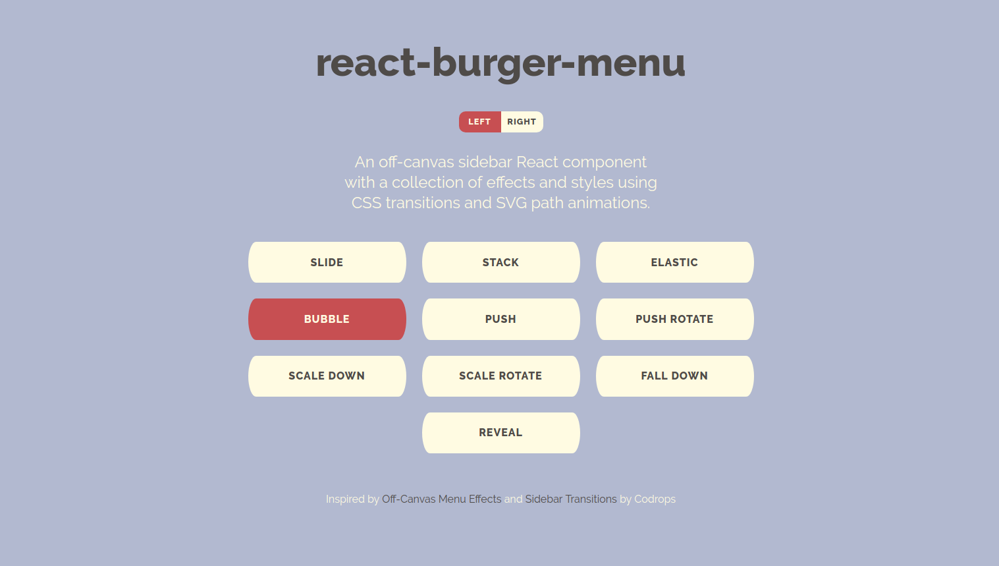
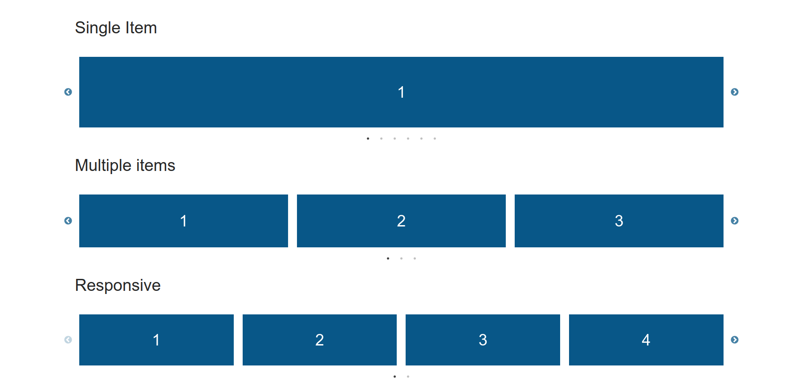
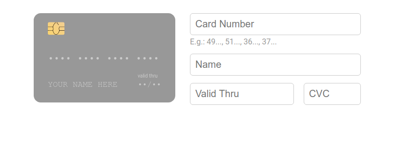
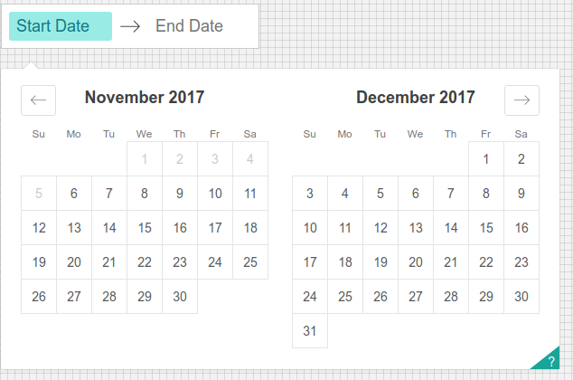
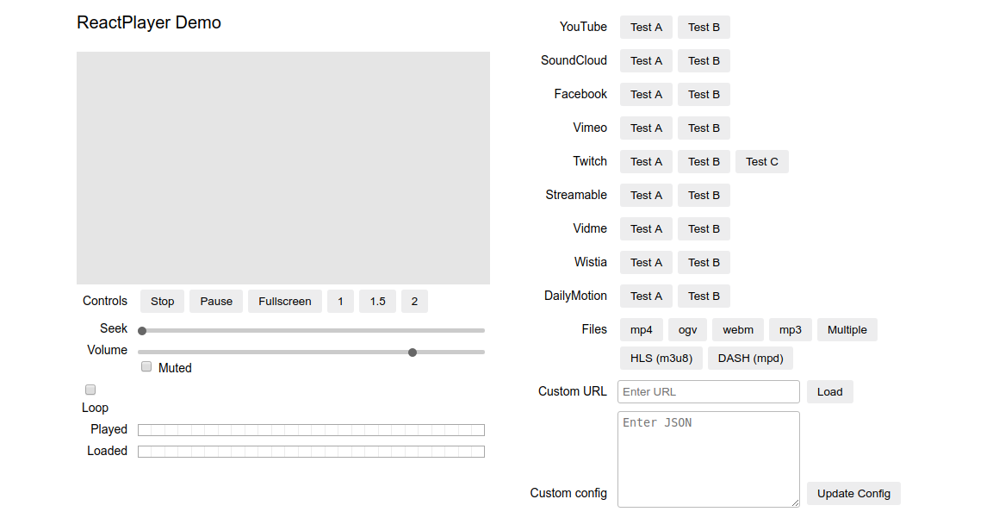
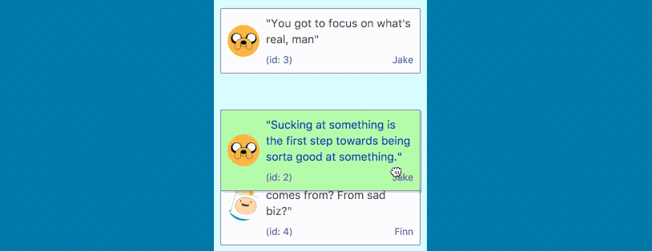

# 7 прекрасных компонентов React

## React Burger Menu
[React Burger Menu](https://github.com/negomi/react-burger-menu)

React-burger-menu предлагает React-компонент боковой панели, лежащей вне холста, с многочисленными эффектами и стилями, а также CSS-переходами. Также этот компонент поддерживает большое количество анимаций, например, «слайд», «стопка», «пузырь», «смещение» и многие другие. Он использует современные функции CSS3, так что некоторые анимации могут неправильно отображаться в отдельных браузерах.

## React Slick

[React Slick](github.com/akiran/react-slick)

React-компонент для создания красивых адаптивных слайдеров типа «карусель». Это основанная на React версия slick carousel. Компонент предлагает больше количество разнообразных вариантов карусели, которые можно настраивать, включая бесконечное вращение, автозапуск, отложенную загрузку и многое другое.

## React Photo Gallery

[React Photo Gallery](https://github.com/neptunian/react-photo-gallery)

Адаптивная и хорошо настраиваемая React-фотогалерея, не имеющая состояния. Она поддерживает исходное соотношение сторон ваших фотографий и использует фактические элементы изображения. Кроме того, вы можете передавать свои пользовательские компоненты изображения для добавления дополнительных функций, таких как подписи и «избранное».

## React Credit Cards

[React Credit Cards](https://github.com/amaroteam/react-credit-cards)

Современный и красивый компонент кредитных карт, который можно использовать в формах оплаты. У него есть встроенный валидатор кредитных карточек, который проверяет номер карты и распознает ее тип. Поддерживает все виды кредитных карт, доступные в Payment.

## React Dates
[React Dates](https://github.com/airbnb/react-dates)

React-dates это интерактивный, полностью оснащенный и дружественный к мобильным устройствам компонент для выбора даты. Он дает вам возможность выбирать отдельную дату или диапазон дат используя встроенные свойства. Вы также можете настроить вид вводимых данных и календарь.

## ReactPlayer

[ReactPlayer](https://github.com/CookPete/react-player)

Компонент React для проигрывания видео из различных источников (файлов и URL), например, YouTube, Facebook, Twitch. Компонент анализирует URL и загружает подходящую разметку и внешние SDK для проигрывания видео. Встроенные свойства могут использоваться для управления громкостью, шириной и высотой плеера и т.п.

## React Beautiful DnD

[React Beautiful DnD](https://github.com/atlassian/react-beautiful-dnd)

Библиотека React от Atlassian для создания компонентов перетаскивания. Она предлагает чистый и мощный API, который прост в использовании, но при этом предоставляет множество параметров настройки и элементов управления. Сгенерированные компоненты имеют плавные управляемые GPU анимации, которые естественно отражают, когда элементы подбираются или переупорядочиваются.

